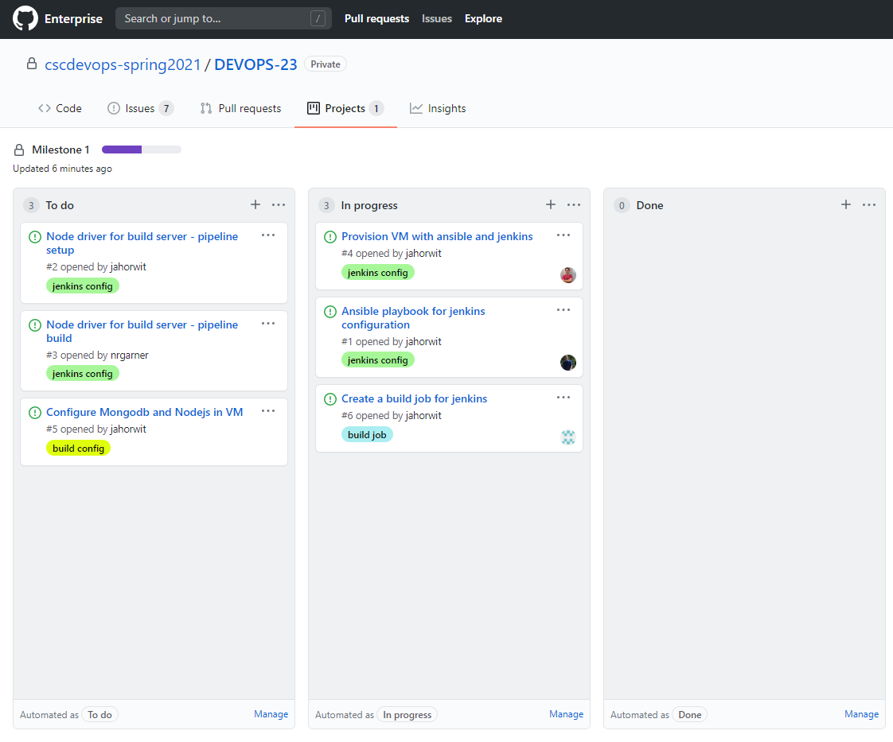

# March 9 Checkpoint

## Work Completed
- Initial upload of CM template
- Initial issue creation and assignment
- Provision and Config planning

## In-progress Assignments
- Nick: Provision VM with ansible and Jenkins
- Josh: Ansible playbook for Jenkins configuration
- Joe: Build job for Jenkins

## Roadmap
Immediate goals are to get provision code working to spin up VM. From there, we will be able to test the ansible playbooks to ensure proper Jenkins config. We are running these tasks in parallel to hopefully allow us to complete them quickly one after another. After configuration is working, we can start on the installation of checkbox.io.

