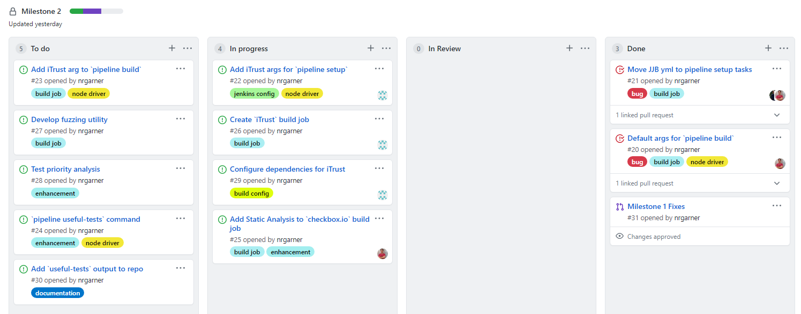

# March 29 Checkpoint - Milestone 2

## Work Completed
- Fixed holdover issues from Milestone 1: node commands, JJB job update task
- Initial Milestone 2 planning and issue creation
- Node commands for `iTrust2` jobs

## In-progress Assignments
- Joe: Ansible tasks for `iTrust2` dependencies and JJB build yml for `iTrust2` job
- Josh: Node driver extension for new commands, authentication with Jenkins and NCSU Github
- Nick: Extension of `checkbox.io` build job, static analysis code

## Roadmap
With the split focus of this Milestone between `checkbox.io` and `iTrust2`, we are running parallel efforts. Initial focus will be to get node commands and configuration working for `iTrust2` before moving to the build job. Simultaneously we will be working on the static analysis code to extend the `checkbox.io` build.

