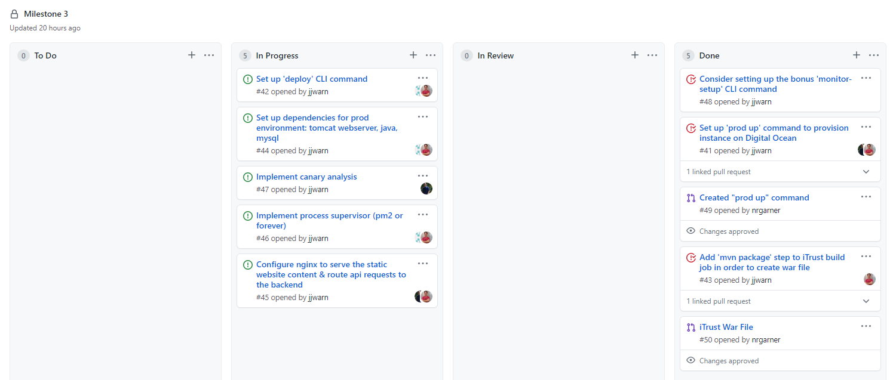

# April 26 Checkpoint - Milestone 3

## Work Completed
- Initial Milestone 3 planning and issue creation
- `prod up` command to provision local and Digital Ocean production instances
- `inventory.ini` dynamically created at runtime based on local vs cloud provision
- iTrust build job extended to create and copy WAR file for deploy
- `deploy` command to run ansible playbooks for dependency install
- Created ansible role for `checkbox` prod install

## In-progress Assignments
- Joe: Tomcat setup
- Josh: Canary analysis with blue-green testing
- Nick: Ansible playbook for iTrust deploy, complete cloud deployments

## Roadmap
Parallel tracking canary analysis alongside deploy. Both efforts progressing nicely, with checkbox nearing completion and iTrust approximately halfway to completed. Hoping to finish deploy efforts within the next few days to funnel all resources to canary analysis for the remaining development time.

