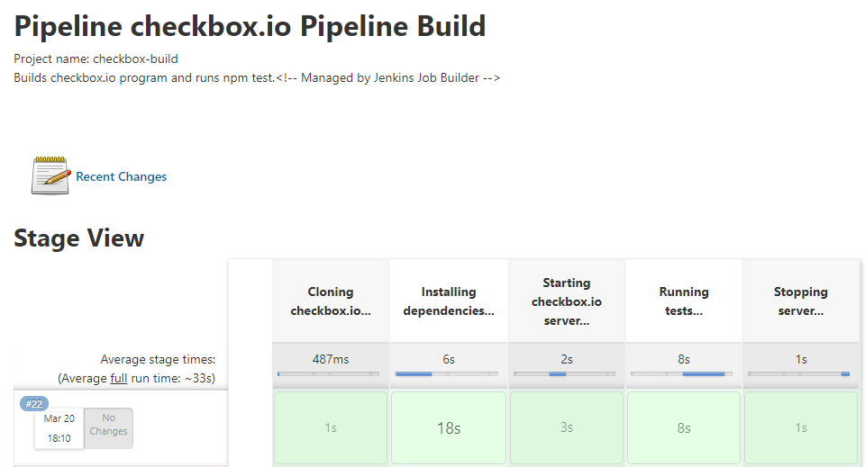

# Team 23 - Spicy Pandas

## CSC 519 - DevOps, Spring 2021

## Usage

Configure Jenkins and build environment:

```shell
# Create .vault-pass file
echo "<VAULT PASSWORD>\n" >> .vault-pass

# Install
npm install
npm link

# Provision and configure VM
pipeline setup
```

***NOTE: If cloning the repo on to a host system that uses Windows OS you may need to update the line break types in '/cm/server-init.sh' from CRLF to LF before running the 'pipeline setup' command.

Run `checkbox-build` build job:

```shell
pipeline build checkbox-build -u <JENKINS USERNAME> -p <JENKINS PASSWORD>
```

## Discussion

Some of the challenging issues we stumbled at during the automation of the setup process:

- We had a hard time getting Jenkins installed using `yum`, ultimately because of the python dependency issue that came up. This took us a while, but we were ultimately able to get it installed.

- It took us a while to figure out why we kept getting an error while creating our Mongo User, but we eventually found out the error was because we were misunderstanding the purpose of the `database` parameter to the mongodb_user module here:

```
mongodb_user:
    database: admin
    name: "{{mongo.MONGO_USER}}"
```

- We also had a difficult time getting the build command to correctly update Jenkins using the jenkins_jobs.ini

- The last big problem we encountered was that when running 'npm test' after triggering our build job, the Jenkins server could not find the environmental variables MONGO_USER, MONGO_PASSWORD, etc. It had turned out that we were previously starting the Jenkins server in the 'jenkins_config' playbook BEFORE defining these variables in the 'build-env' playbook, so the Jenkins server did not inherit these environmental variables. We corrected this problem by instead defining the variables in the 'jenkins_config' playbook before the last restart of the Jenkins server and were then able to succesfully pass all the required tests after triggering our build job. 

## Screencast

### **[Screencast Link](https://youtu.be/NQFJzpqOw0M)**
[](https://www.youtube.com/watch?v=NQFJzpqOw0M)
